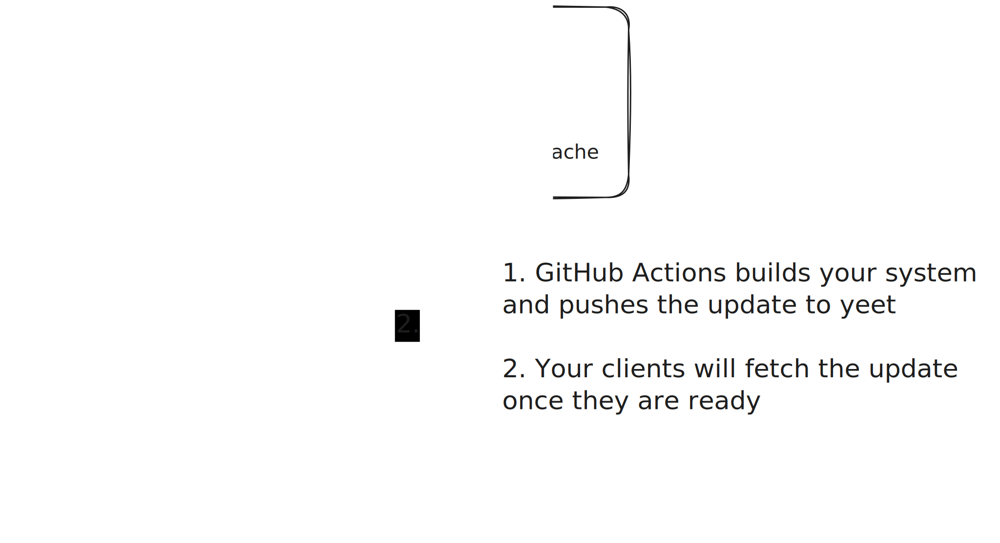

# Yeet
 

 
 

A better pull-based nix deployment tool.
 

 

[Features](#features)

&nbsp;~&nbsp;

[Installing](#installing)

&nbsp;~&nbsp;

[Documentation](#documentation)

 
 

Fleet management that scales, from home lab to enterprise setup. Manage devices that are not available at build time - build now, use later. Especially useful for physical clients such as laptops.

 

## Features

- Flakes, npins or custom: Use the Nix format you want
- Beautiful interactive CLI
- Host uptime tracking
- Centralized devices builds: Build once, use everywhere
- No restrictions on layout: If it builds from nix it can be deployed
- Bring your own cache: Use cachix or bring your own custom cache
- Authentication by identity: No auth with tokens, yeet implements [RFC 9421](https://datatracker.ietf.org/doc/rfc9421/)

### Coming Soon

- ARM support: not tested yet
- MacOS support: possible but not as good yet
- Racing exporter
- Encrypted netrc
- Certificate pinning

## Installing

On NixOS you can use Npins or Flakes to add the `yeet`(agent) and `yeetd`(server) modules.

Non NixOS distros can install the server directly with `cargo install https://github.com/yeet-rs/yeet.git yeetd`

## Documentation

You can build the latest version of the documentation using `mdook serve book`.
Make sure you have `mdbook-mermaid` installed and it uses the same version of `mdbook`.

## Contributing

Feel free to open a PR for any type of changes!

---

Built with <3 by srylax without AI
